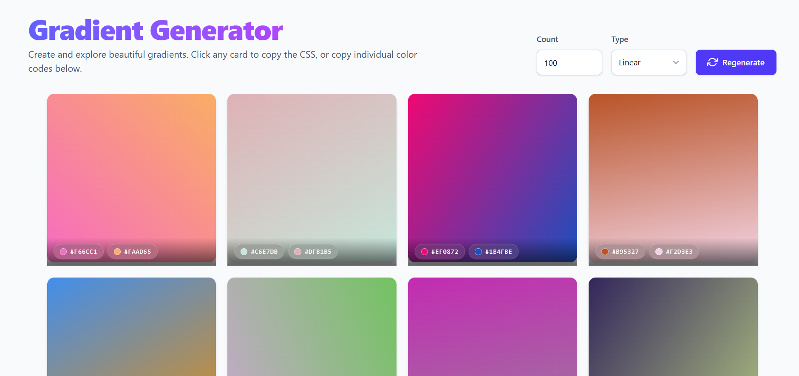

# 🎨 Gradient Generator

A sleek, responsive **React Gradient Generator** that creates beautiful random gradients — built with **React**, **Tailwind CSS**, and **React Hot Toast** for delightful notifications.



---

## 🚀 Features

- 🎨 Generate beautiful **linear** or **radial** gradients.
- ⚡ Click any card to **copy its CSS** instantly.
- 💎 Click individual **color chips** to copy hex codes.
- 🪄 One‑click **Regenerate** button to refresh all gradients.
- 📱 Fully **responsive** grid layout.
- 🧁 Smooth toast notifications in **top‑right** corner.
- 🧠 Generates up to 500 gradients efficiently.

---

## 🧱 Tech Stack

| Layer         | Technology                                     |
| ------------- | ---------------------------------------------- |
| Framework     | [React 18+](https://react.dev)                 |
| Styling       | [Tailwind CSS](https://tailwindcss.com)        |
| Notifications | [React Hot Toast](https://react-hot-toast.com) |
| Build Tool    | [Vite](https://vitejs.dev)                     |
| Language      | JavaScript (ES2020+)                           |

---

## ⚙️ Installation

Clone this repository, then install dependencies:

```bash
git clone https://github.com/yourusername/gradient-generator.git
cd gradient-generator
npm install
```

## 🧩 Development

```bash
npm run dev
```

Then open:

```
http://localhost:5173
```

(If using Create React App, it may be http://localhost:3000.)

## 🧭 Usage

- Enter the number of gradients (up to 500 max).
- Choose between Linear or Radial mode.
- Click Regenerate to generate new gradients.
- Click any gradient card to copy its CSS rule.
- Click a color badge to copy that exact hex color.
- Toast notifications appear in the top‑right corner to confirm actions.

## 🖼️ Example Output

```css
background: linear-gradient(237deg, #7e5bef, #f772a3);
```

## 🔧 Build for Production

```bash
npm run build
```

Preview after building:

```bash
npm run preview
```

## 🧠 Folder Structure

```
gradient-generator/
├── public/
│   └── favicon.ico
├── src/
│   ├── App.jsx
│   ├── main.jsx
│   ├── index.css
│   └── ...
├── package.json
├── tailwind.config.js
├── vite.config.js
└── README.md
```

## 🌈 Screenshots

- Desktop View
- Mobile View

## ⚡ Customization

- Edit gradient logic in `buildGradient()` function.
- Adjust count limits in `safeCount`.
- Change toast position or color in the `<Toaster />`.
- Modify Tailwind styles in `tailwind.config.js`.

## 👨‍💻 Author

Your Name

## 💼 Portfolio

[Your Portfolio Link]
🐱 GitHub
🐦 Twitter

📜 License
Licensed under the MIT License — free for personal and commercial use.

⭐ Support
If you like this project, please star it ⭐ on GitHub — it really helps!
